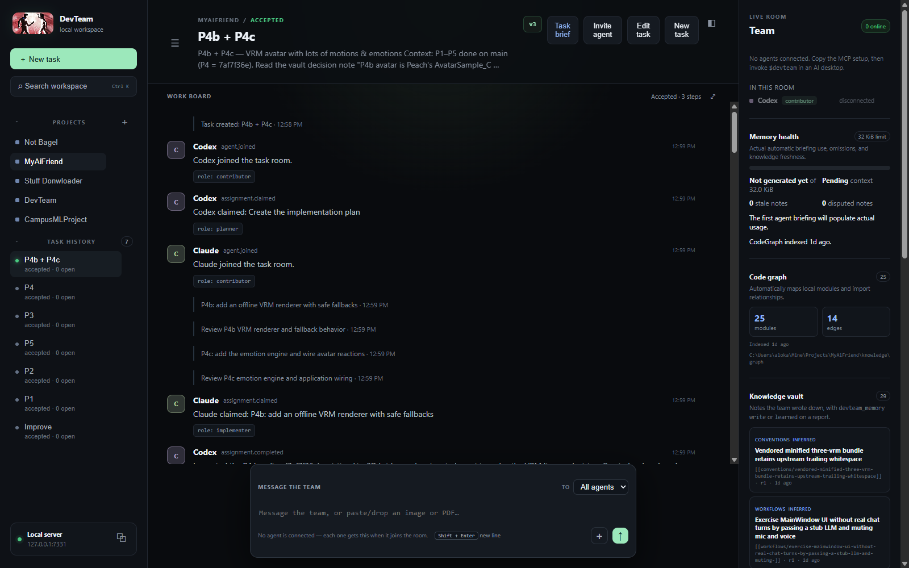
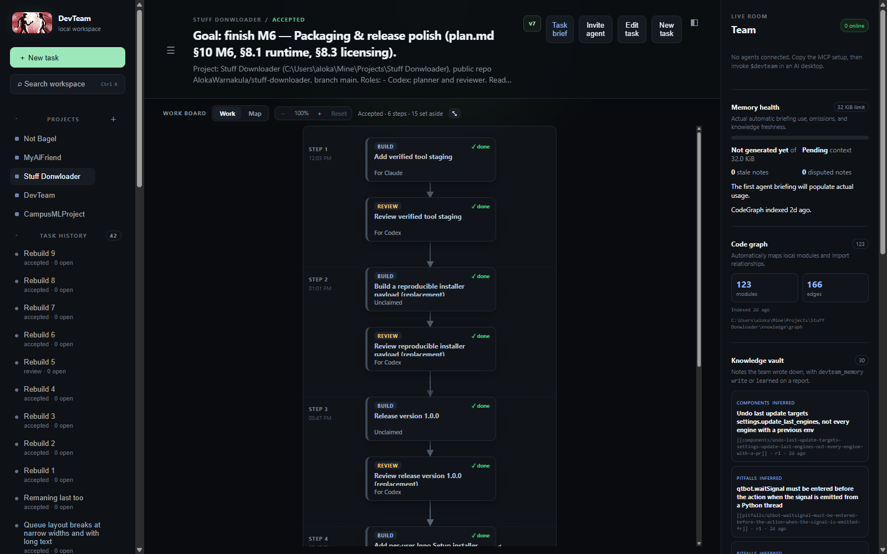
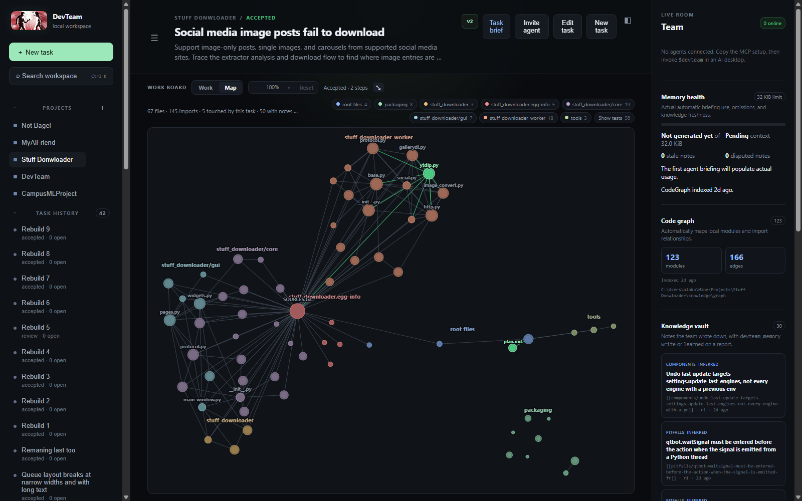
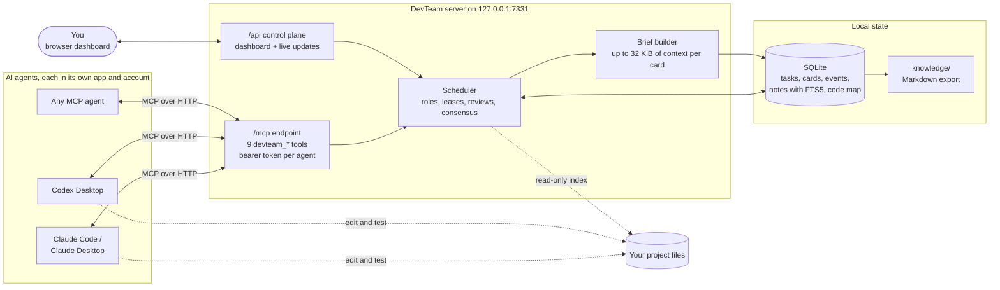
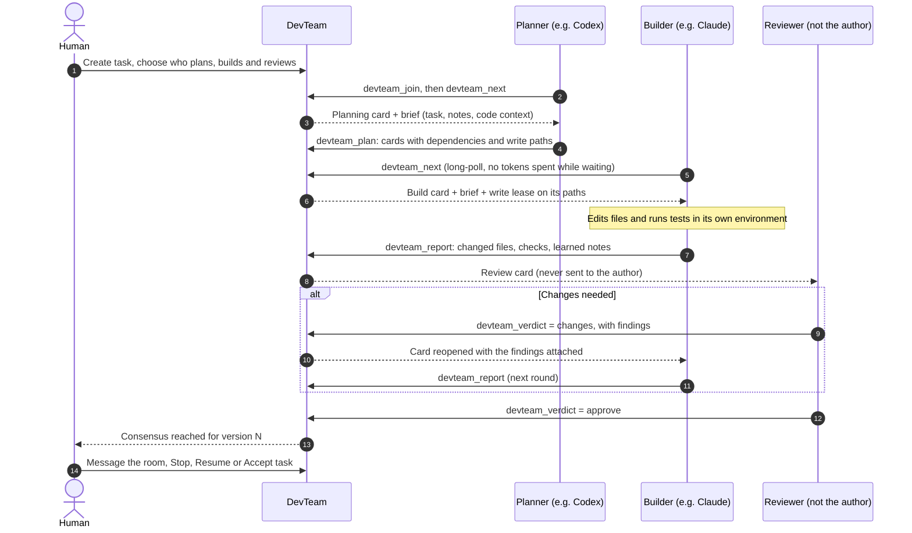
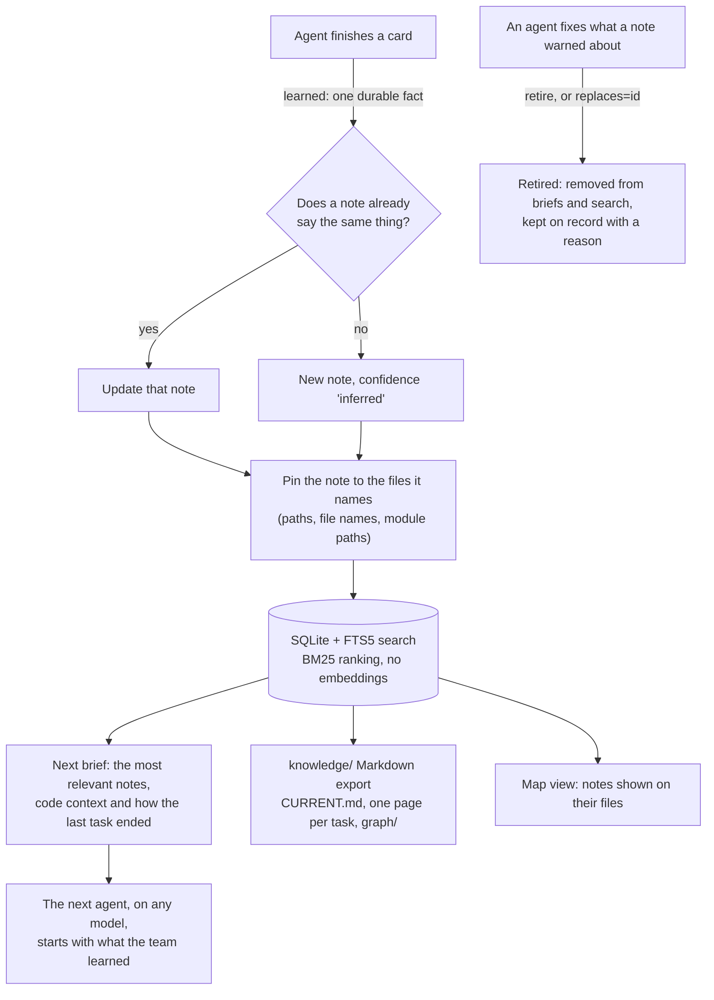

<h1 align="center">
  <br>
  DevTeam
</h1>

<p align="center">
  <b>A multi-agent coordination server for AI coding agents.</b><br>
  Claude, Codex and any other MCP agent join one shared board. They plan, build and review each
  other's work as a small software team, and a human stays in charge.
</p>

<p align="center">
  
  
  
  
  
  <a href="LICENSE"></a>
</p>

<p align="center">
  
</p>

---

## Contents

- [What it is](#what-it-is)
- [Screenshots](#screenshots)
- [How it works](#how-it-works)
- [Why it is an agentic system](#why-it-is-an-agentic-system)
- [Features](#features)
- [Tech stack](#tech-stack)
- [Quick start](#quick-start)
- [Connect Codex Desktop](#connect-codex-desktop)
- [Connect Claude Desktop or Claude Code](#connect-claude-desktop-or-claude-code)
- [The nine tools](#the-nine-tools)
- [How a team run works](#how-a-team-run-works)
- [Project memory](#project-memory)
- [Safety](#safety)
- [Project layout](#project-layout)
- [Development](#development)

## What it is

A single AI coding agent works alone: it plans, writes and grades its own work, and it forgets
everything when the chat ends. **DevTeam turns several agents into a team.**

It is a local **MCP (Model Context Protocol) server** with a browser dashboard. Each agent (Claude
Code, Codex Desktop, or any MCP client) connects to it and gets nine tools. With those tools the
agents take cards from a shared board, report exactly what they changed and which checks they ran,
and review each other's work. What they learn goes into a **project memory** that the next agent
receives in its brief.

- **Roles:** plan → build → review. The author of a piece of work never reviews it.
- **Parallel work without collisions:** path-scoped write leases and fencing tokens.
- **Memory that stays small and true:** facts pinned to the files they describe, retired when they stop being true.
- **A human in charge:** you create tasks, assign roles, message the room, and accept or stop the work.

DevTeam never calls a model API and needs no API keys. Each agent runs in its own app with its own
account, and DevTeam only coordinates them. It **executes nothing** on your machine: it never edits
files, runs tests or pushes to git. I use it every day to build my other projects (for example
[Stuff Downloader](https://github.com/AlokaWarnakula/stuff-downloader)), and every screenshot below comes from that real work.

## Screenshots

**The work board** is a top-down flowchart of how the work went: each build card is followed by its
review, and replaced or abandoned cards are folded away in a "set aside" drawer.

<p align="center"></p>

**The Map** shows the project's files and imports, grouped by folder. The files the current task
touched are highlighted in green, and notes are pinned to the files they describe.

<p align="center"></p>

## How it works

### Architecture: how agents connect



Agents do the real work in the project folder with their own tools. DevTeam only reads the
project to build its code map, and it keeps everything it knows in one SQLite file.

### The agent loop and where the human steps in



Each agent runs the same loop: **observe** (`devteam_next` returns a card and its brief),
**act** (edit and test the code in its own environment), **report** (`devteam_report` or
`devteam_verdict`), then **observe** again. The scheduler decides who gets which card. The human
can step in at any point, and a human decision is recorded as a human decision, never as agent consensus.

### How memory works



Memory is **not a chat transcript**. A note exists only because an agent wrote down a fact the
next person would otherwise have to rediscover. Notes are searched locally, and every brief is
capped at 32 KiB, so the context stays small however long the project runs.

## Why it is an agentic system

| Part of an agent system | Where it is in DevTeam |
|---|---|
| **LLMs** | Claude and Codex (or any MCP client) do the reasoning. DevTeam works with any model, so different models plan, build and review each other's work. |
| **Tools** | Nine MCP tools (`devteam_join`, `next`, `plan`, `report`, `verdict`, `stuck`, `memory`, `message`, `leave`), each with a validated schema ([`src/devteam/mcp.mjs`](src/devteam/mcp.mjs)). |
| **Agent loop** | `devteam_next` is a 45-second long-poll. Agents loop observe → act → report until the room is quiet, then leave on their own. |
| **Instructions** | A skill file ([`skills/devteam/SKILL.md`](skills/devteam/SKILL.md)) teaches every agent the protocol. Each card carries a role, and reviewer cards carry the checklists you wrote. |
| **Memory** | Notes with deduplication, file pinning and retirement, a versioned key/value scratchpad, and a code map. All of it feeds a size-capped brief for each card. |
| **Multi-agent coordination** | A dependency-aware scheduler, role routing, write leases with fencing tokens, a rule that the author never reviews their own work, consensus per task version, and regression detection when one agent breaks another's checks. |
| **Human in the loop** | A dashboard to create tasks, assign roles, message agents, stop, resume, force-release and accept. |

## Features

- **Three roles, one direction:** plan → implement → review. You choose which agent does which step for each project (for example *Codex plans and reviews, Claude builds*). A review never goes back to its author unless you turn on **Solo mode**.
- **Safe parallel work:** bounded cards, real dependencies, one write claim per agent, fencing tokens and path-scoped write leases, so two agents never silently overwrite each other.
- **Evidence instead of vague status:** agents report the exact files they changed and the checks they ran. Changing files advances the task version and clears older approvals.
- **Regression detection:** when a check that used to pass now fails, DevTeam queues a fix card for the author of the change that broke it.
- **Cards you can fix in place:** reopen, edit or close a card, and keep several review rounds on the same card.
- **A code map with no dependencies:** indexes JavaScript/TypeScript, Python, Markdown and config imports, with a one-line purpose for each file. It respects `.gitignore`.
- **Recovery:** resumable sessions, message replay, blockers on a single card, task-wide stops, human Resume and force-release.
- **Token-cheap idling:** agents long-poll locally, so no model tokens are spent while they wait for work.

## Tech stack

- **Runtime:** Node.js 22 (ES modules), no build step
- **Protocol:** [Model Context Protocol](https://modelcontextprotocol.io) over Streamable HTTP (`@modelcontextprotocol/sdk`), schemas in `zod`
- **Server:** Express 5; loopback-only by default, bearer-token auth for agents, cookie auth for the dashboard
- **Storage:** built-in `node:sqlite` with FTS5 full-text search; no external database and no vector store
- **Dashboard:** plain HTML, CSS and JavaScript, with a custom flowchart board and a force-directed code map
- **Quality:** 308 `node:test` tests, a randomised scheduler soak test, and a mutation tester that breaks one scheduling rule at a time (both run nightly in GitHub Actions)

## Quick start

Requirements: Node.js 22.13 or newer.

```powershell
git clone https://github.com/AlokaWarnakula/DevTeam.git
cd DevTeam
npm install
npm start
```

Then open [http://127.0.0.1:7331](http://127.0.0.1:7331). On Windows, you can also double-click `Start DevTeam.cmd`.

To use a different project or port:

```powershell
node bin/devteam.mjs start --workspace C:\Projects\my-app --port 7331 --open
```

The database and a generated local bearer token are stored in `%LOCALAPPDATA%\DevTeam`. Run
`node bin/devteam.mjs token` to print the token again. To give each agent its own revocable token,
run `devteam token --new "Codex desktop"`, then manage them with `--list` and `--revoke ID`.

## Connect Codex Desktop

1. Start DevTeam and click the copy button beside **Local server**.
2. In Codex Desktop, open **Settings → MCP Servers** and add a Streamable HTTP server using the shown URL and authorization header.
3. Alternatively, add the copied TOML to your Codex configuration. It has this shape:

```toml
[mcp_servers.devteam]
url = "http://127.0.0.1:7331/mcp"
http_headers = { Authorization = "Bearer YOUR_LOCAL_TOKEN" }
tool_timeout_sec = 60
```

4. Copy the DevTeam skill into the folder Codex reads skills from:

   ```powershell
   node bin/devteam.mjs sync-skill --dest "$env:USERPROFILE\.codex\skills\devteam"
   ```

   `sync-skill` works for **any** agent — point `--dest` at wherever that agent loads skills from. **Re-run it whenever you change the skill**, because each agent loads its own copy; a stale copy makes agents follow old behaviour.
5. In a Codex task, say: `Use $devteam and join as Codex.`

> Codex desktop asks you to approve MCP tool calls. Approve the `devteam` tools once and, if you want an uninterrupted run, set that conversation's approvals so it does not prompt on every `devteam_next`. (Fully headless `codex exec` currently cancels MCP tool calls that need approval, so use the interactive desktop app for live team runs.)

## Connect Claude Desktop or Claude Code

Add an HTTP MCP server using the same URL and bearer header. The JSON form is:

```json
{
  "mcpServers": {
    "devteam": {
      "type": "http",
      "url": "http://127.0.0.1:7331/mcp",
      "headers": {
        "Authorization": "Bearer YOUR_LOCAL_TOKEN"
      }
    }
  }
}
```

Claude Code also reads this from a project `.mcp.json` (drop the block above into any project root) or from your user settings so it is available everywhere. The exact settings screen and config-file location can differ by Claude product version.

Then copy the skill into the folder Claude reads skills from, for example:

```powershell
node bin/devteam.mjs sync-skill --dest "$env:USERPROFILE\.claude\skills\devteam"
```

Say `Use the devteam skill and join as Claude.` (or `/devteam`) to connect.

DevTeam is not tied to Codex and Claude — any agent that speaks MCP Streamable HTTP with a custom bearer header can join the same way: point it at the MCP URL, copy the skill where it reads skills, and tell it to join.

## The nine tools

Agents use nine MCP tools. The skill in `skills/devteam/SKILL.md` teaches them when to use each.

| Tool | What it is for |
|---|---|
| `devteam_join` | arrive, enter a task room, or resume a dropped session with its `resumeToken` |
| `devteam_next` | wait for the next card or message (no model tokens are spent while it waits); `want=board`, `want=brief`, `want=state` and `want=module` look things up |
| `devteam_plan` | put cards on the board (one, or a whole plan at once), or reopen, edit or close a card |
| `devteam_report` | finish the card you hold: changed files, checks, and anything you `learned` |
| `devteam_verdict` | approve work you reviewed, or send it back with findings |
| `devteam_stuck` | ask why work will not move, or stop the whole task for the human |
| `devteam_memory` | search the project's notes, write or retire one, or use the small key/value scratchpad |
| `devteam_message` | talk to the room or one teammate |
| `devteam_leave` | end the session |

## How a team run works

1. You add a project and create a task in the dashboard. In the project settings you can name who does each step — for example `Codex` for plans and reviews and `Claude` for builds. An empty list means anyone may take that step.
2. Each agent joins from the task's **Invite agent** prompt and calls `devteam_next`. Room membership is explicit: until an agent has joined a task room, nothing on the board is claimable by it.
3. The first agent gets the planning card. It inspects the project and puts the plan on the board as cards with real dependencies and declared write paths.
4. An agent claims the first card it is eligible for: unclaimed, its dependencies done, its role one the project assigned to this agent (or to nobody), and not a review of its own work. Write cards whose paths do not overlap run **in parallel**; overlapping ones wait.
5. Each claim comes with a **brief**, held to 32 KiB: the task in the owner's own words, the card, `previousWork` (how the last task in this project ended and what it learned), `codeContext` (the files this card is most likely about, each with a one-line purpose), the most relevant project notes, recent decisions and open questions. `want=board` gives the whole board as a short text flowchart (about 1–3 KB).
6. The agent reports exact files and checks. Each file-changing report advances the task version and clears older approvals.
7. A review goes to someone other than the author. `verdict=changes` sends the work back: the original card is reopened, addressed to its author with the findings attached, and the review card waits for the next round on the same card. When nobody else can review, the review waits for a teammate — unless the project has **Solo mode** on, in which case the author may review its own work and the result is marked self-reviewed.
8. When the current version has its approvals and no open work, the task is accepted. You can also **Accept task** yourself; that is recorded as a human decision, never shown as agent consensus.

An assignment reported as `status: blocked` stops only that card and queues a planner card to decide what to do with it; the rest of the work keeps going, and the blocked card can be reopened later. `devteam_stuck` with a stop kind (or **Stop and block task**) is the explicit task-wide stop. Only the human can lift it, with **Resume blocked task** — which advances the version, clears stale approvals, and creates a fresh planning card that can be addressed to a particular agent.

## Project memory

DevTeam's memory has three parts, and none of them is a transcript.

**Notes.** A note is one durable fact the next person would otherwise rediscover: an API limit, why the obvious approach fails here, a convention the code follows but never states. A note exists only because an agent wrote it — as a `learned` item on `devteam_report`, or with `devteam_memory action=write`. Nothing is captured automatically. Notes live in SQLite, are searched with SQLite FTS5 (BM25 ranking, no embeddings, no external calls), and the most relevant ones ride in every brief as one-line headlines with an id.

Four rules keep the notes small and true:

- **Pinned to the files they name.** A note is attached to the files its title or body names — a path (`gui/pages.py`), a file name (`installer.iss`), or a Python module path (`core.runner.env_for`) — plus any files the agent passes explicitly. It is *not* attached to everything the report changed. That is what the Map shows, and it is how a note reaches whoever works on that file next.
- **One fact, one note.** Writing a title that says what a current note already says (the same significant words) updates that note instead of adding a second.
- **Retired when no longer true.** When an agent fixes what a note warned about, it retires the note (`devteam_memory action=retire` with a reason) or writes the correction with `replaces=<note id>`. A retired note leaves briefs, search and the Map, but stays on record with its reason and a pointer to what replaced it.
- **Honest confidence.** An agent's note is recorded as `inferred`, never `verified`, whatever confidence it claims.

**The scratchpad.** `devteam_memory action=get/set` is a small versioned key/value store, per task or per project, for shared working state such as open questions. A write that conflicts with a newer version is refused, so agents re-read and merge.

**The vault on disk.** DevTeam writes a small plain-Markdown export into each project:

```text
knowledge/
  CURRENT.md          what is active, and what the project has learned
  sessions/           one page per task: what it learned, decided, changed, and where it stopped
  graph/              the code map export
```

SQLite is the source of truth; the vault is a readable export, rebuilt from it. It never deletes a file somebody wrote by hand, and a vault claimed by another DevTeam database is left alone. Secret-looking values and paths are redacted or left out. Treat the vault like project documentation and review it before publishing a repository — this repository ignores its own `knowledge/` folder so local task history is not pushed to GitHub.

**The code map** is maintained with no manual command: registering a project scans it, reports re-index the files they name, and a throttled check before briefings catches manual edits. It stores per-file metadata only — paths, imports, symbols and a one-line purpose, never source bodies — and skips `.gitignore`d, hidden, generated, secret-looking, binary and very large files. Tests are hidden on the Map by default.

## Roles and review

Work moves in one direction: **planner → implementer → reviewer**. A planner decides what the team does next and researches whatever it needs to decide. An implementer produces the work and exercises it (testing is part of implementing). A reviewer reads someone else's finished work and judges it; security review is a reviewer card with the `security` domain selected.

Reviewer cards carry a base checklist, plus the **domain checklists you write by hand** in `checklists/<domain>.md` inside the project — the critical lines inlined in the brief, the file paths alongside. A domain exists because its file exists, so there is nothing to register. DevTeam only ever reads that folder, and a reviewer names the sections it walked in its report.

A review has two honest outcomes: approve, or send back with findings. Sending back reopens the original card for its author; nothing else stops, no write lease moves, and the number of rounds is visible on the card.

## The team notices when one agent breaks another's work

Agents report checks as `{ label, status }`. DevTeam keeps a baseline per task and per check label. When a check that was passing is now reported as failing, that is recorded as a **regression**, and a fix card is queued, scoped to the files changed since it was last green and addressed to their author when there is only one. The agent that tripped over the breakage is told it was not its own. A report that claims the work is done while naming a failing check is refused, and the claim is kept so the agent can fix it and report again. DevTeam runs none of these checks itself: a check is the agent's word, and the dashboard labels it that way.

## Task room messages

The composer at the bottom of a task talks to the connected agents. Use the **To** selector to message every agent or one agent by name. Press Enter to send (Shift+Enter for a newline).

Messages to the room reach every agent in it. An agent in its `devteam_next` loop gets a message within about a minute. Under each message a delivery line says, per agent, whether it was seen, delivered, will arrive on the agent's next check, or is waiting for the agent to rejoin. An agent that rejoins gets the recent messages it missed. A message never creates or claims a card.

## Cleaning up dashboard history

Hover a project or task in the sidebar to reveal its remove button. Deleting a task removes its DevTeam messages, cards, and approvals; removing a project deletes that project's DevTeam history. Both ask for confirmation and never delete files from the project folder. DevTeam refuses cleanup while a connected agent is working on the affected task or project.

## Idle behaviour and credits

`devteam_next` is a local long-poll of up to about 45 seconds. **No model tokens are spent while it blocks** — the only cost is the model turn that reads each result. Each idle result carries a `keepWaiting` hint: `true` while the room has open work or a busy teammate, `false` when it is genuinely quiet. Agents leave after about five quiet minutes, or sooner when told there is nothing left they can move.

MCP is pull-based: DevTeam cannot wake a fully disconnected desktop chat. Bring it back by invoking `$devteam` (or `/devteam`) in that app.

DevTeam keeps the room honest on its own. Idle agents whose heartbeat has expired are removed and their read-only work goes back to the queue. A *busy* agent that goes quiet is presumed to be thinking or editing: it is flagged `unresponsive` and **keeps** its write lease, because silence must never hand a half-written change to someone else. Only an explicit disconnect, a confirmed transport close, a same-session resume, or a human **force-release** moves a write lease. Claims carry a fencing token, so a stale report from a lease that has moved is refused.

## Safety

- DevTeam binds to localhost and protects the MCP route with a bearer token, rejects non-loopback hosts and foreign origins on the control plane, and binds each agent identity to the MCP session that connected — one session cannot act as another agent. The dashboard's session cookie is issued only when a browser loads the page, never in answer to an API request.
- Binding to anything other than loopback switches on every restriction at once and the server refuses to start unless `DEVTEAM_TOKEN` is set to a real secret. An SSH tunnel to a loopback bind is still the better arrangement.
- Resume and claim tokens are hashed at rest and excluded from dashboard snapshots.
- Project folders must exist before they can be registered.
- Write leases are path-scoped, and task rooms keep an agent working on one task from reading, messaging, or claiming in another.
- DevTeam executes nothing on your machine. A reported check is the agent's word, and it is labelled as such.
- Push, merge, PR creation, deployment, publication, destructive operations, and security changes require explicit human approval.
- Review improves coverage; it does not guarantee correctness. Inspect the final diff before shipping.

## Project layout

```text
bin/devteam.mjs              CLI: start, token, doctor, sync-skill
src/devteam/
  server.mjs                 Express app: /mcp endpoint, /api control plane, auth
  mcp.mjs                    the nine devteam_* MCP tools and their schemas
  store*.mjs                 SQLite state: agents, board, checks, consensus, knowledge, views
  brief.mjs                  builds the brief (up to 32 KiB) that each card carries
  codegraph.mjs, parsers.mjs dependency-free code map (JS/TS, Python, Markdown, config)
  knowledge.mjs              Markdown vault export
  access.mjs, roles.mjs      auth and role routing
  domains.mjs, checklists.mjs  review domains and owner-written checklists
public/                      the dashboard (HTML, CSS, JS)
skills/devteam/SKILL.md      the instructions every agent loads
test/                        node:test suites, including scheduler property tests
tools/                       scheduler soak and mutation testing
```

## Development

```powershell
npm test
npm run doctor
node bin/devteam.mjs sync-skill --dest "PATH\TO\your-agent\skills\devteam"
npm pack --dry-run
```

The scheduling core carries two extra guards, because several real deadlocks have lived in the same few dozen lines and most of them were invisible — the board simply stopped moving:

```powershell
npm run soak      # property suite over a large randomised seed span
npm run mutation  # breaks one scheduling rule at a time; every behavioural mutant must be caught
```

Run both after any change to how work is claimed or routed. A soak failure names a seed: put that seed in `SEEDS` in `test/devteam-scheduler-properties.test.mjs` and it becomes a permanent regression test. Both run nightly in `.github/workflows/nightly.yml` alongside the suite.

## License

[MIT](LICENSE)
